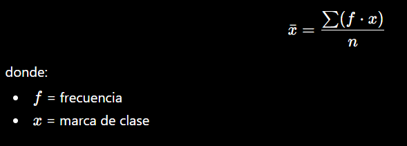

## Tabla de Frecuencias y Análisis Estadistico

---

Con base en la tabla de distribución de frecuencias, el histograma, el polígono de frecuencias y la ojiva, se pueden realizar varios análisis estadísticos importantes:

# 1. Análisis general de los datos

Los datos tienen las siguientes características:

+ Número de datos: 30
+ Valor mínimo: 35
+ Valor máximo: 76
+ Rango: 41
+ Número de clases: aproximadamente 6
+ Tamaño de clase: aproximadamente 7

Esto indica que los datos fueron agrupados correctamente en intervalos para facilitar su interpretación.

# 2. Clase con mayor frecuencia (Moda)

La clase con mayor frecuencia es:

| Intervalo | Frecuencia |
| --------- | ---------- |
| 42 – 49   | 9          |

Esto significa que la mayor concentración de datos está entre 42 y 49.

La distribución presenta una tendencia central en ese intervalo, por lo que podría considerarse la clase modal.

# 3. Comportamiento del histograma

El histograma muestra que:

* Las frecuencias aumentan desde la primera clase hasta la segunda.
* Luego comienzan a disminuir gradualmente.
* Existe una cola hacia la derecha.

Esto sugiere una distribución:

ligeramente asimétrica positiva, con concentración en valores medios, y pocos valores altos.

Visualmente no parece una distribución uniforme.

# 4. Interpretación del polígono de frecuencias

El polígono permite observar la tendencia de los datos:

* El punto máximo ocurre en la marca de clase 45,5.
* Después de ese punto las frecuencias disminuyen.

Esto confirma que:

la mayor parte de los datos está en valores medios, y existen menos observaciones en los extremos.

# 5. Interpretación de la ojiva

La ojiva representa la frecuencia acumulada.

Se puede concluir:

* Hasta el intervalo 42–49 ya se acumula el 46,67% de los datos (14 datos).
* Hasta 56–63 se acumula aproximadamente el 86,67%.
* Los valores superiores a 70 son muy pocos.

La ojiva también permite estimar:

mediana, percentiles, cuartiles.

# 6. Concentración porcentual

Según la frecuencia relativa porcentual:

| Intervalo | FR%    |
| --------- | ------ |
| 35 – 42   | 16,67% |
| 42 – 49   | 30,00% |
| 49 – 56   | 23,33% |
| 56 – 63   | 16,67% |
| 63 – 70   | 10,00% |
| 70 – 77   | 3,33%  |

Se observa que:

* Más del 53% de los datos están entre 42 y 56.
* Solo el 3,33% está entre 70 y 77.

# 7. Posibles medidas estadísticas

A partir de la tabla se podrían calcular:

Media aproximada

Usando marcas de clase:

Mediana

La mediana estaría aproximadamente en la clase:

49−56

porque allí se supera la mitad de los datos acumulados.

Moda

La moda corresponde aproximadamente a:

42−49

por ser la clase de mayor frecuencia.

# 8. Conclusión general

Los datos presentan:

concentración en valores intermedios, pocos valores extremos, una distribución ligeramente sesgada hacia la derecha, y un comportamiento relativamente estable.

La mayoría de observaciones se encuentra entre:

        42 y 63

lo cual representa el núcleo principal de la distribución.

---
## Como se puede determinar el número de clases en excel de acuerdo con el ejercicio?

El número de clases en una distribución de frecuencias normalmente se determina usando la Regla de Sturges, que es la que parece utilizarse en tu ejercicio.

La fórmula es:

        k=1+3.322log
                    10
	​

(n)

Donde:

k = número de clases
n = número total de datos

En tu ejercicio:

n=30

Entonces:

k=1+3.322log
10
	​

(30)

Calculando:

log
10
	​

(30)≈1.4771

Entonces:

k=1+(3.322)(1.4771)
k≈1+4.907
k≈5.907

Se aproxima a:

k≈6 clases

Por eso en la tabla aparecen 6 intervalos de clase.

Cómo hacerlo en Excel

La fórmula en Excel sería: 

''' excel
</> excel
=1+3,322*LOG10(A1)
'''
Resultado:

5,907

Luego se redondea:

=REDONDEAR.MAS(1+3,322*LOG10(30);0)

Resultado final:

6
Después de obtener el número de clases

Se calcula el tamaño de clase:

Amplitud=
N
u
ˊ
mero de clases
Rango
	​

En tu ejercicio:

A=
6
76−35
	​

A=
6
41
	​

A≈6.83

Se aproxima a:

7

Por eso los intervalos avanzan aproximadamente de 7 en 7:

35–42
42–49
49–56
etc.
que otra forma se puede calcular?

Además de la Regla de Sturges, existen otros métodos para calcular el número de clases en una distribución de frecuencias. Los más utilizados son:

1. Regla de la raíz cuadrada

Es uno de los métodos más simples.

La fórmula es:

k=
n
	​

Donde:

k = número de clases
n = número de datos

En tu ejercicio:

k=
30
	​

k≈5.47

Se aproxima a:

k≈6
En Excel
=RAIZ(30)

o:

=SQRT(30)
2. Regla de Rice

Esta regla suele generar más clases que Sturges.

La fórmula es:

k=2
3
n
	​

Aplicando:

k=2
3
30
	​

k≈2(3.11)
k≈6.22

Resultado aproximado:

k≈6
En Excel
=2*(30^(1/3))
3. Regla de Scott

Esta es más estadística y se basa en la desviación estándar.

Primero calcula el ancho de clase:

h=
3
n
	​

3.5σ
	​

Luego:

k=
h
Rango
	​

Donde:

σ = desviación estándar
h = amplitud óptima
k = número de clases

Este método se usa mucho en histogramas avanzados.

4. Regla de Freedman–Diaconis

Más robusta cuando existen valores extremos.

La fórmula del ancho es:

h=
3
n
	​

2(IQR)
	​

Donde:

IQR = rango intercuartílico

Luego:

k=
h
Rango
	​

Es muy usada en análisis de datos y ciencia de datos.

5. Método manual o empírico

En muchos ejercicios académicos se usan reglas prácticas:

Cantidad de datos	Número sugerido de clases
20 – 50	5 a 7
50 – 100	7 a 10
Más de 100	10 o más

Con 30 datos normalmente se usan:

5 o 6 clases
Comparación para tu ejercicio

Con n=30:

Método	Resultado
Sturges	6
Raíz cuadrada	6
Rice	6
Manual	5–6

Todos coinciden aproximadamente en:

6 clases

## ¿Cuál es el más usado?
Método	Uso

Sturges	Estadística básica y Excel
Raíz cuadrada	Método rápido
Rice	Datos medianos
Scott	Estadística avanzada
Freedman-Diaconis	Ciencia de datos y outliers

En ejercicios académicos como el tuyo, normalmente se utiliza Sturges.